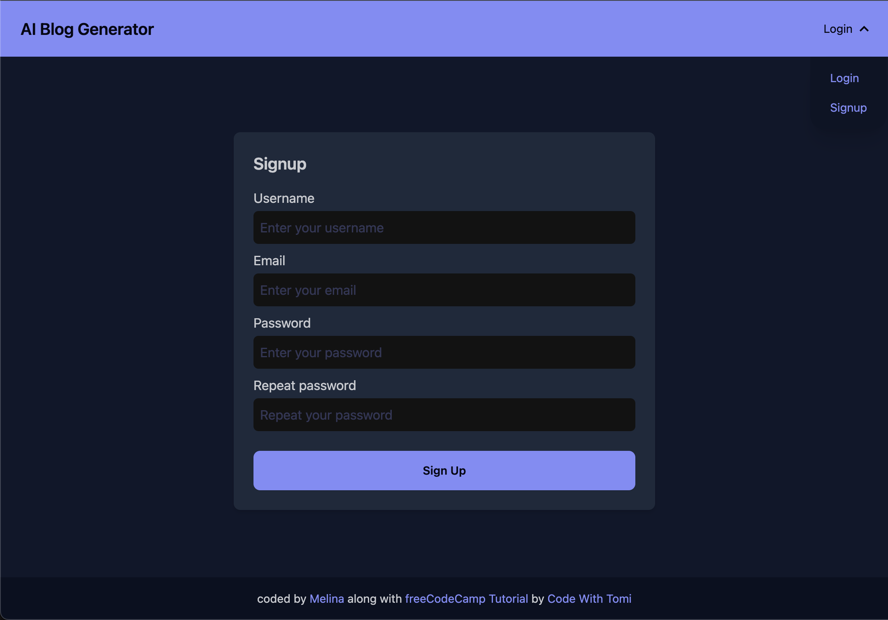
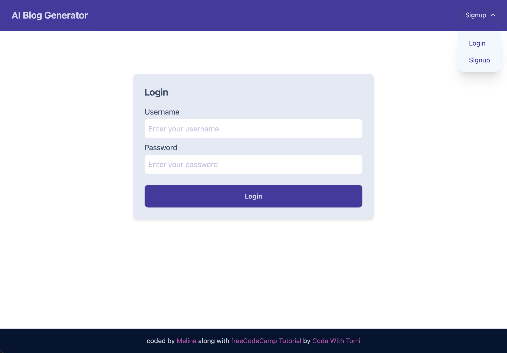
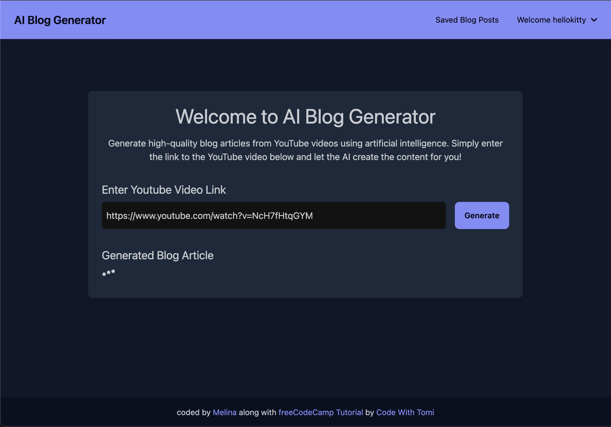
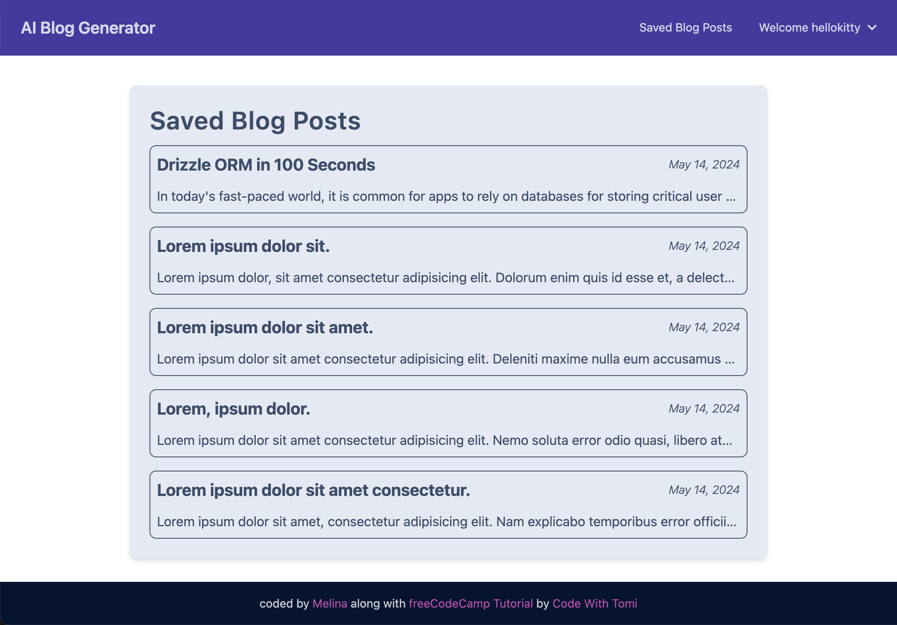
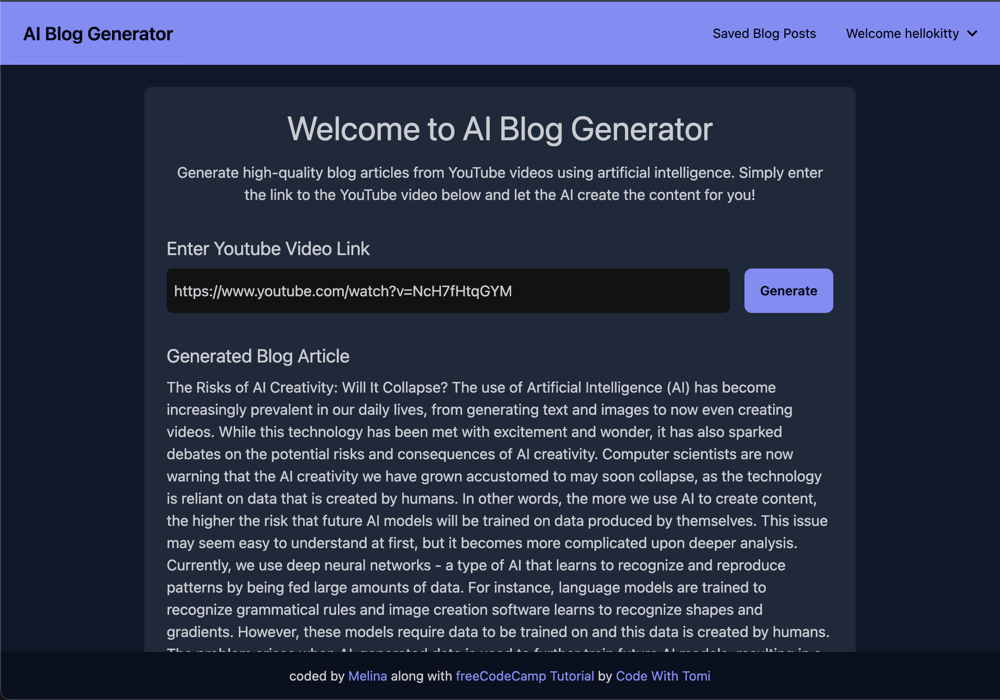
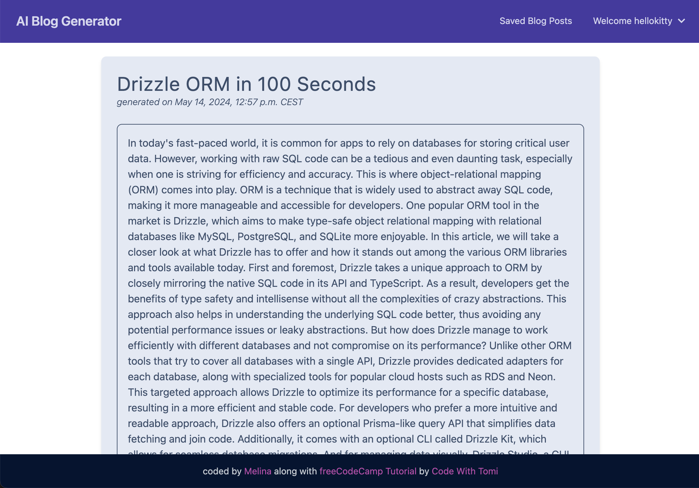

# Youtube Video to Blog Article Generator

## Stack & Tools

## Features

In this app a user can sign up and generate blog articles from Youtube videos simply by entering the video link. AssemblyAI generates a mp3 file from the audio which is then transcripted into text. OpenAI is used to write a blog style article based on the transcript. All generated articles are stored in a PostgreSQL for the user to access them later. The focus of this project was on learning django backend development so the frontend is kept very simple with only html files, some basic javascript & tailwindcss/daisyui for the style.

Idea from [Python Backend Development Course](https://youtu.be/ftKiHCDVwfA?si=9-jNn8F5gm3Wbtcb) by [Code With Tomi](https://www.youtube.com/@CodeWithTomi).

## Preview

<table>
<tbody>

<!--# 1. Reihe  ---------- -->
<tr>

<td align="center">

</td>

<td align="center">

</td>

</tr>

<!--# 2. Reihe  ---------- -->
<tr>

<td align="center">

</td>

<td align="center">

</td>
</tr>

<!--# 3. Reihe  ---------- -->
<tr>

<td align="center">

</td>

<td align="center">

</td>
</tr>

</tbody>
</table>
